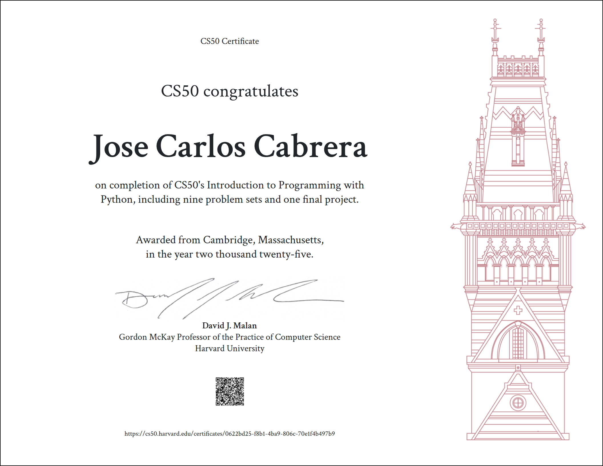

# 🐍 CS50's Introduction to Programming with Python

This repository contains my solutions to Harvard’s **CS50P** course, completed in 2025.  
It includes all my homework files and my **final project**.

---

## 📂 Contents

Some of the files included in this repository:

- `hello.py` → First program
- `mario.py` → Printing pyramids
- `readability.py` → Text readability calculator
- `caesar.py` → Caesar cipher implementation
- `fuel.py` → Fraction to fuel gauge
- `taqueria.py` → Menu ordering program
- `project/` → My **final project** (see its own [README](project/README.md))

---

## 🏆 Final Project

The final project has its own README with a full description and instructions.  
👉 Check it out here: [Final Project](project/README.md)

---

## 📜 Certificate

I successfully completed the CS50P course in 2025.  
Here’s my certificate of completion:

---

## ⚙️ Technologies

- Python 3
- Standard libraries (`math`, `random`, `csv`,`random`,`json`,`statistics`,`re`,`pytest` .)
- External libraries (as required in final project)

---

## ✨ Notes

This repository is part of my programming journey and interest in Data Analysis, given that Python is one the most important languages in Data Science.  
It showcases my progress in Python fundamentals, algorithms, and problem-solving skills.